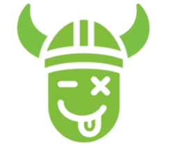
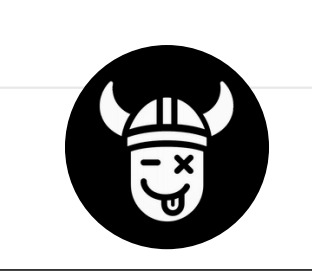

# Surtale Logo Değiştirme Rehberi

## Yöntem 1: Resim Dosyası (Önerilen)

### Adım 1: Logo dosyanızı hazırlayın
- Format: PNG, JPG, SVG (SVG en iyisi)
- Boyut: 60x60 piksel veya daha büyük
- Arka plan: Şeffaf (PNG) veya yeşil (#4CAF50)

### Adım 2: Dosyayı proje klasörüne koyun
```
Taha/
├── index.html
├── styles.css
├── script.js
├── surtale-icon.png  ← Ana logo dosyanızı buraya koyun
└── surtale-nav-icon.png  ← Navigation logosu için
```

### Adım 3: HTML'de değiştirin
index.html dosyasında şu satırları bulun ve değiştirin:

**Header logosu için:**
```html
<!-- ESKİ -->
<div class="logo-icon">
    <svg>...</svg>
</div>

<!-- YENİ -->
<div class="logo-icon">
    
</div>
```

**Hikaye logoları için:**
```html
<!-- ESKİ -->
<svg width="24" height="24">...</svg>

<!-- YENİ -->

```

**Bottom navigation logosu için:**
```html
<!-- ESKİ -->
<svg width="24" height="24">...</svg>

<!-- YENİ -->

```

## Yöntem 2: Online Logo URL'si

Eğer logonuz internette varsa, direkt URL kullanabilirsiniz:

```html

```

## Yöntem 3: Base64 Kod

Küçük logolar için base64 kodunu kullanabilirsiniz:

```html

```

## CSS Ayarları

Logo boyutlarını CSS'de de ayarlayabilirsiniz:

```css
.logo-icon img {
    width: 32px;
    height: 32px;
    border-radius: 8px;
}

.story-circle img {
    width: 24px;
    height: 24px;
    border-radius: 50%;
}

.surtale-logo img {
    width: 24px;
    height: 24px;
    border-radius: 50%;
}
```

## Öneriler

1. **SVG formatı** en iyisidir (ölçeklenebilir)
2. **Şeffaf arka plan** kullanın
3. **Yüksek çözünürlük** hazırlayın
4. **Küçük dosya boyutu** için optimize edin

